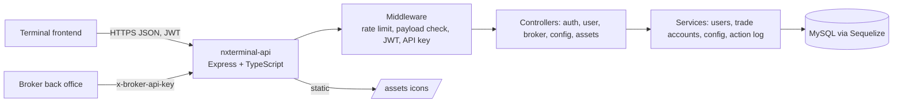

# nxterminal-api


Backend REST API of the **NXtrader** trading terminal. It handles authentication, users and their settings, trade accounts, orders, positions and financial transactions, and serves runtime configuration to the terminal clients.

> This is the API behind separately published frontends. It contains no UI.

> Reference code, not audited. Early-stage (Jan-Feb 2024) work. See "Security notes" before deploying anywhere.

## Architecture



## Stack

- Node.js, TypeScript, Express 4
- MySQL with Sequelize 6 (migrations and seeders via `sequelize-cli`)
- JWT access and refresh tokens, bcrypt password hashing
- express-rate-limit, request-ip, cors, cookie-parser

## Run

```bash
npm install
cp .env.example .env                  # fill in values
cp config/config.example.json config/config.json   # for sequelize-cli only; delete afterwards
npx sequelize-cli db:migrate
npx sequelize-cli db:seed:all         # optional, dev config rows
npm start                             # ts-node ./index.ts
npx tsc --noEmit                      # type check
```

Trade tables (accounts, orders, positions, transactions) are documented as reference DDL in [`docs/schema.sql`](docs/schema.sql); only the `configs` and `assets` tables ship as migrations.

## Environment variables

| Variable | Purpose |
| --- | --- |
| `PORT` | Listen port (default 3000) |
| `HOST` | Allowed CORS origin in production |
| `DEV_HOST` | Allowed CORS origin when `NODE_ENV=development` |
| `NODE_ENV` | `development` or `production` |
| `DB_HOST`, `DB_USERNAME`, `DB_PASSWORD`, `DB_DATABASE` | MySQL connection |
| `ACCESS_TOKEN_SECRET` | Signs access JWTs |
| `REFRESH_TOKEN_SECRET` | Signs refresh JWTs |
| `BROKER_API_KEY` | Shared key expected in the `x-broker-api-key` header for broker routes |

## API surface

All routes are mounted under `/terminal`.

| Area | Routes |
| --- | --- |
| Auth | `POST /api/auth/login`, `POST /api/auth/token` (refresh), `POST /api/auth/logout` |
| User (JWT) | `GET /api/user`, `POST /api/user/password`, `POST /api/user/setting/theme/:theme`, `POST /api/user/setting/watchlist` |
| Broker (API key) | `POST /api/broker/user`, `GET /api/broker/user/:userId`, `POST /api/broker/user/:userId/reset`, `GET /api/broker/transaction/finance[/:currency[/:userId]]` |
| Config (public) | `GET /api/config/setup` (WebSocket and API base URLs, stored in the `configs` table) |
| Assets (public) | `GET /api/assets/:type/:asset` (serves `src/assets/:type/:asset.svg` or `.png`) |

## Icons: bring your own icon set

The repository does not ship coin icons. To use the assets route, place your own icons at `src/assets/crypto/<symbol>.svg` (or `.png`), for example from the CC0 `cryptocurrency-icons` package. Note that coin logos may be third-party trademarks.

## Security notes

- Public endpoints (`/api/config`, `/api/assets`, `/api/auth/*`) and the broker endpoints (guarded only by a static shared header key) are not hardened. **Run this service behind network-level protection** (private network, VPN, WAF or reverse-proxy allow-lists).
- Generated user passwords use `Math.random` (8 characters) and are not cryptographically strong. Replace before any real use.
- Keep real secrets only in `.env` (git-ignored). A gitleaks pre-commit hook and CI workflow are included.

## Context

Built in early 2024 as the server side of the NXtrader terminal. Client names and infrastructure details were removed before publication.

## License

MIT, see [LICENSE](LICENSE).
